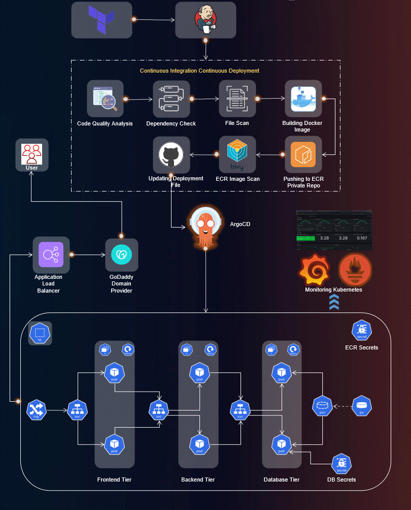

# MERN Stack DevOpsified !
    

## DevSecOps practices for deployment of a 3-tier MERN stack application

## Tech-stack:  
- AWS, Terraform, SonarQube, Jenkins, Docker, Trivy, ArgoCD, Elastic Kubernetes Service (EKS), Helm, Prometheus, Grafana

## Major Steps:
- Create an IAM user & generate AWS Access key
- Install Terraform & AWS CLI to deploy the Jenkins Server on AWS (EC2) using Terraform
- Configure Jenkins & install the required plugins
- Deploy the EKS Cluster using eksctl commands (for ease)
- Configure the Load Balancer on EKS as the application will have an ingress controller
- Create separate Amazon ECR private repositories for frontend & backend
- Install & configure ArgoCD
- Configure SonarQube for the DevSecOps pipeline
- Configure the plugins in Jenkins to integrate all necessary tools like SonarQube, Trivy, NodeJS, Docker, etc.
- Set up monitoring for the EKS Cluster using Helm, Prometheus and Grafana
- Deploy the 3-tier application using ArgoCD with the required Kubernetes manifest files

  
